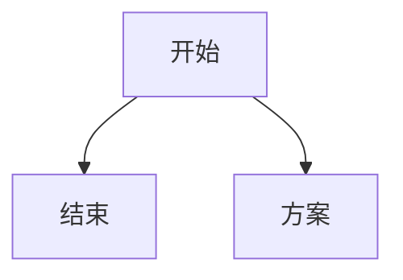

在没有 Web UI 的情况下运行
```shell
# 在无头模式下，您也可以在测试运行时更改用户数。
# 按 w 添加1个用户 或者 W 添加10用户
# 按 s 删除1个用户 或者 S 删除10用户
locust -f locust_files/my_locust_file.py --headless -u 100 -r 5
```

设置测试的时间限制
```shell
locust --headless -u 100 --run-time 1h30m
locust --headless -u 100 --run-time 60 # default unit is seconds
```

将负载py抽离
```shell
# 如果您分别在 low_load.py 和 high_load.py 中定义了一个高/低负载 Shape 类
locust -f locustfile.py,low_load.py
locust -f locustfile.py,high_load.py
```

```shell
# 如果你想分阶段递增并发用户数压测，找到系统最大的QPS，
# 你可以用--step-load --step-users XX --step-time XX命令，
# 不用再手动去增加用户数和压测时间。
locust -f locustfile.py  --master  --master-bind-port 9800 --headless -u 800 -r 50 --expect-workers 10 -t 50m -s 10  --step-load --step-users 200 --step-time 10m --csv ./locustlog/ 
```


压测数据通过python画图展示。来自于：[csnd drew_gg](https://www.cnblogs.com/drewgg/p/13524255.html "超链接title")
```python
# -*- coding = utf-8 -*-
# ------------------------------
# @time: 2020/8/15 16:05
# @Author: drew_gg
# @File: deal_csv.py
# @Software: api_locust
# ------------------------------

import os
import time
import csv
import datetime
from pyecharts.charts import Line
from pyecharts import options as opts
from pyecharts.globals import ThemeType

"""
# pyecharts使用文档
# http://pyecharts.org/#/zh-cn/intro
"""

pl = os.getcwd().split('api_locust')
path_html = pl[0] + 'api_locust\\resource\\html\\'


def report(interface_name, history_csv, stats_csv):
    """
    locust生成报表
    :param interface_name:
    :param history_csv:
    :param stats_csv:
    :return:
    """
    tm = []
    uc = []
    qps = []
    fps = []
    avg_time = []
    all_r = ''
    all_qps = ''
    all_avg_time = ''
    with open(history_csv, 'r') as f:
        hc = csv.reader(f)
        for x, i in enumerate(list(hc)):
            if i:
                if x != 0:
                    tm.append(time.strftime('%H:%M:%S', time.localtime(int(i[0]))))
                    uc.append(str(round(float(i[1]), 2)))
                    qps.append(str(round(float(i[4]), 2)))
                    fps.append(str(round(float(i[5]), 2)))
                    avg_time.append(str(round(float(i[20]), 2)))
    with open(stats_csv, 'r') as f:
        sc = csv.reader(f)
        for x, i in enumerate(list(sc)):
            if x != 0 and len(i) != 0:
                all_r = str(i[2])
                all_qps = str(round(float(i[9]), 2))
                all_avg_time = str(round(float(i[5]), 2))
    locust_title = "[{0}]压测情况：[ARC：{1}, QPS: {2}, AVT: {3}]".format(interface_name, all_r, all_qps, all_avg_time)
    locust_html_name = path_html + interface_name + str(datetime.datetime.now().strftime('%m%d%H%M%S')) + '.html'
    line = (
        Line(init_opts=opts.InitOpts(theme=ThemeType.CHALK, width="1800px", height="800px"))
        .add_xaxis(tm)
        .add_yaxis('user', uc, is_smooth=True)
        .add_yaxis('qps', qps, is_smooth=True)
        .add_yaxis('fps', fps, is_smooth=True)
        .add_yaxis('avg_t', avg_time, is_smooth=True)
        .set_global_opts(
            title_opts=opts.TitleOpts(title=locust_title),
            tooltip_opts=opts.TooltipOpts(trigger="axis"),
            toolbox_opts=opts.ToolboxOpts(is_show=True, orient="vertical", pos_left="1%",  pos_top="10%"),
            xaxis_opts=opts.AxisOpts(type_="category", boundary_gap=False,),
        )
    )
    line.render(locust_html_name)


if __name__ == "__main__":
    stats = "D:\\api_locust\\resource\\csv\\locust_exhibition_home.py0826095139_stats.csv"
    history = "D:\\api_locust\\resource\\csv\\locust_exhibition_home.py0826095139_stats_history.csv"
    report('a', history, stats)
```


